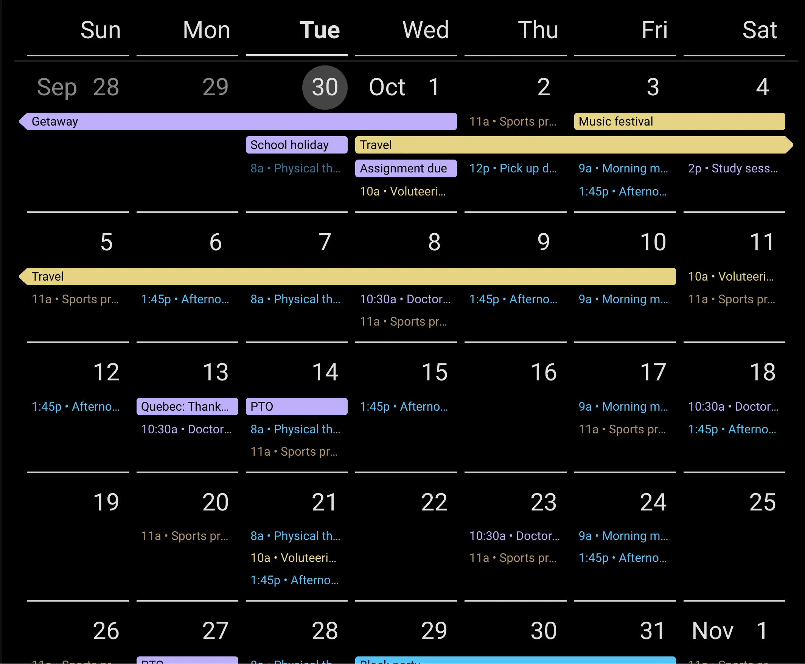
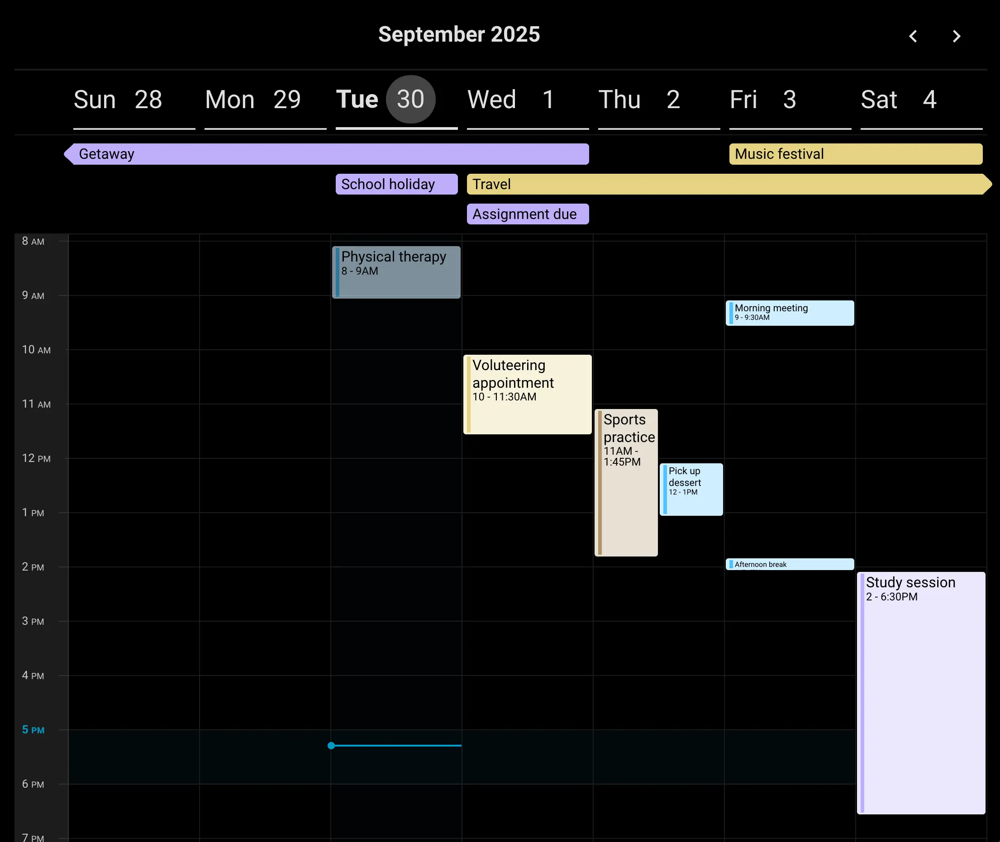

# Pebble Dashboard

Customizable dashboard for Home Assistant

Included cards

- Clock Card
- Weather Card
- Calendar Card

Additional features

- Dynamic background images behind sections
- Resizable two section layout
- All cards are configurable via the UI
- Designed for use on a full screen dashboard

## Installation

### HACS

This plugin is available in HACS (Home Assistant Community Store)

  
<h4 style="display: inline-block">Installation instructions</h4>

1. Open HACS within your Home Assistant instance
2. Select the More Options menu (top right icon) and open "Custom repositories"
3. Add this repository:
   - Repository: https://github.com/bostaunieux/ha-pebble-dashboard
   - Type: Dashboard
4. Close the dialog and search for "Pebble Dashboard"
5. Click the Download button

### Manual

Altneratively, you can manually install from the Home Assistant UI

  
<h4 style="display: inline-block">Installation instructions</h4>

1. Download the `pebble-dashboard.js` file from the [latest release](https://github.com/bostaunieux/ha-pebble-dashboard/releases)
2. Copy the `pebble-dashboard.js` file into your config/www folder
3. Add the script as a resource in your Home Assistant instance
   1. From the UI, navigate to Settings > Dashboards > More Options (top right icon) > Resources > Add Resource
   2. Add the resource:
      - Url: `/local/pebble-dashboard.js`
      - Resource type: JavaScript Module
   - Note: If the Resources menu is not available, verify you have enabled Advanced Mode in your User Profile

## Configuration

### Dashboard

When creating a new dashboard, select the `Pebble Sections (pebble-dashboard)` layout type. Once created, the setup will resemble that of the `Sections` layout type, with the following changes

- Only two sections can exist - these can not be deleted from the UI
- In edit mode, a resize bar allows selecting the relative width of the left section
- The two sections will extend the full height of the browser viewport
- The edit menu for each section allows setting an image source to use as a background behind all cards

### Stack Section

Stack sections provide formatting and background image options for organizing cards within the Pebble Dashboard layout. This section type is selected automatically when using this layout type.

Section background images can be configured to pull from the following sources

- None - Don't set a background image
- Local Media - Source images from a local media directory containing photos. This depends on the [Media source](https://www.home-assistant.io/integrations/media_source/) integration being enabled. This is enabled by default when using [Default Config](https://www.home-assistant.io/integrations/default_config/).
- Picsum - Sources images from https://picsum.photos/.
- Entity - Sources the image from a sensor or image entity within Home Assistant. This allows setting up automations to update the image on a schedule, sourcing it from public APIs or other integrations. More details to come...
- Photo URLs - Manually curate a list of image URLS accessible on the Internet

| Option | Type | Default | Description |
|--------|------|---------|-------------|
| `vertical_align` | string | "start" | Vertical alignment of cards in section: "start", "middle", "end", "between", "around" |
| `horizontal_align` | string | "start" | Horizontal alignment of cards in section: "start", "middle", "end" |
| `bg_blur` | number | 0 | Background blur amount in pixels; 0 will disable blur |
| `border_radius` | number | "none" | Border radius in pixels (0, 2, 4, 6, 8, 10, 12, 14, 16, 18, 20, 22, 24) or "none" |
| `photo_source` | string | "none" | Background image source: "none", "local_media", "picsum", "entity", "remote" |
| `refresh_interval` | number | 60 | How often to refresh background images (minutes) |
| **Photo Source Options** | | | |
| `media_source` | string | - | **Local Media**: Media source path |
| `collection` | string | "all" | **Picsum**: Collection type ("all" or "nature") |
| `entity_id` | string | - | **Entity**: Entity ID (sensor, image, or input_text domain) |
| `photos` | array | [] | **Remote**: Array of photo URLs |

### Cards

Cards can be used on any type of dashboard, but are designed for use with Pebble Dashboard. Add them to existing dashboards using the standard add card flow. They will generally have a transparent background set to allow a section's background image to be visible, if configured.

All cards are configurable via the UI

### Clock Card

Options

| Option | Type | Default | Description |
|--------|------|---------|-------------|
| `show_seconds` | boolean | false | Show seconds in the time display |
| `show_date` | boolean | false | Show the current date below the time |
| **Standard Card Options** | | | |
| `text_size` | number | 100 | Text size as a percentage | 

### Weather Card

| Hourly Weather | Daily Weather |
| -- | -- |
| |  |

The total number of forecast units will depend on the weather entity used. If more entries are available than fix in view, the forecast will be scrollable horizontally.

| Option | Type | Default | Description |
|--------|------|---------|-------------|
| `entity` | string | - | Weather entity to display (required) |
| `hide_today` | boolean | false | Hide current weather conditions |
| `today_secondary` | array | - | Additional info to show: "sun", "wind" |
| `today_description_inline` | boolean | false | Show weather description inline |
| `hide_forecast` | boolean | false | Hide weather forecast |
| `forecast_type` | string | "hourly" | Forecast type: "hourly", "daily", "twice_daily". Options dependent on selected `entity` |
| **Standard Card Options** | | | |
| `text_size` | number | 100 | Text size as a percentage | 

### Calendar Card

Note the "Consolidate multi-day events" option is experimantal and only works in modern browsers (from 2023+)

If enabled, weather entries will be added to all available days, showing the high and low temps, as well as a descriptive weather icon.

| Monthly Calendar | Weekly Calendar |
| -- | -- |
|  |  |
  
| Option | Type | Default | Description |
|--------|------|---------|-------------|
| `calendars` | array | [] | List of calendar entities to display |
| `show_view_toggle` | boolean | false | Show toggle to switch between month/week views |
| `view_type` | string | "month" | Default view: "month" or "week" |
| `event_refresh_interval` | number | 15 | How often to refresh events (minutes) |
| `enable_weather` | boolean | false | Enable weather display in calendar |
| `weather_entity` | string | - | Weather entity for calendar (if enabled) |
| **Month View Options** | | | |
| `month_calendar_start` | string | "current_week" | Start point: "current_week" or "start_of_month" |
| `num_weeks` | number | 12 | Number of weeks to show (1-24) |
| `week_start` | string | "0" | Week start day: "0" (Sunday) or "1" (Monday) |
| `events_span_days` | boolean | false | Consolidate multi-day events (experimental) |
| **Week View Options** | | | |
| `week_calendar_view` | string | "current_week" | View type: "current_week", "next_5_days", "next_7_days" |
| `week_start` | string | "0" | Week start day: "0" (Sunday) or "1" (Monday) |
| `events_span_days` | boolean | false | Consolidate multi-day events (experimental) |
| **Standard Card Options** | | | |
| `text_size` | number | 100 | Text size as a percentage | 

## Disclaimer

The pebble layout extends the built-in grid sections layout. As Home Assistant evolves, there is a risk these changes may conflict and prevent this layout from being fully functional. My intent is to keep this up to date with current versions of Home Assistant, but there may be lag time in applying fixes.
