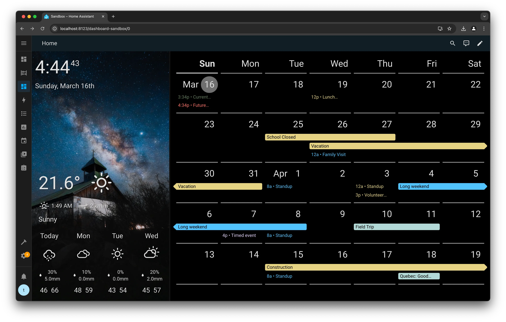

# Pebble Dashboard

Customizable dashboard for Home Assistant

Supported cards

- Clock Card
- Weather Card
- Calendar Card

Additional features

- Dynamic background images behind sections
- Resizable dual section layout
- Designed for use on a full screen dashboard

## Installation

### HACS

This plugin is available in HACS (Home Assistant Community Store)

1. Open HACS within your Home Assistant instance
2. Select the More Options menu (top right icon) and open "Custom repositories"
3. Add this repository:
   - Repository: https://github.com/bostaunieux/ha-pebble-dashboard
   - Type: Dashboard
4. Close the dialog and search for "Pebble Dashboard"
5. Click the Download button

### Manual

1. Download the `pebble-dashboard.js` file from the [latest release](https://github.com/bostaunieux/ha-pebble-dashboard/releases)
2. Copy the `pebble-dashboard.js` file into your config/www folder
3. Add the script as a resource in your Home Assistant instance
   1. From the UI, navigate to Settings > Dashboards > More Options (top right icon) > Resources > Add Resource
   2. Add the resource:
      - Url: `/local/pebble-dashboard.js`
      - Resource type: JavaScript Module
   - Note: If the Resources menu is not available, verify you have enabled Advanced Mode in your User Profile